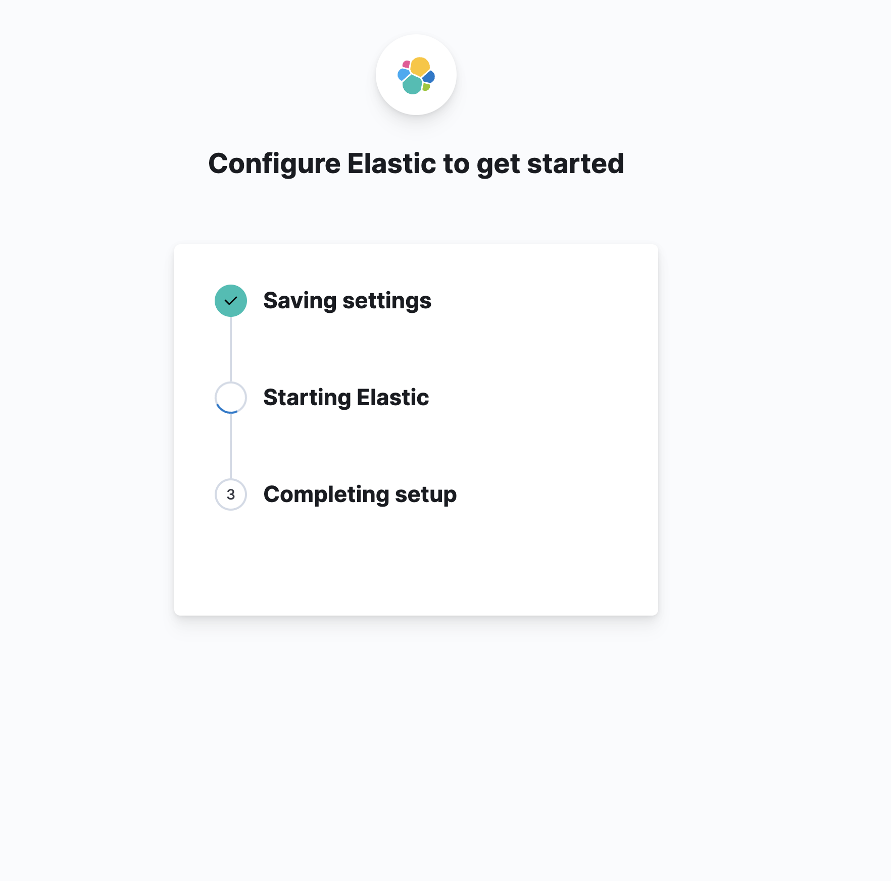
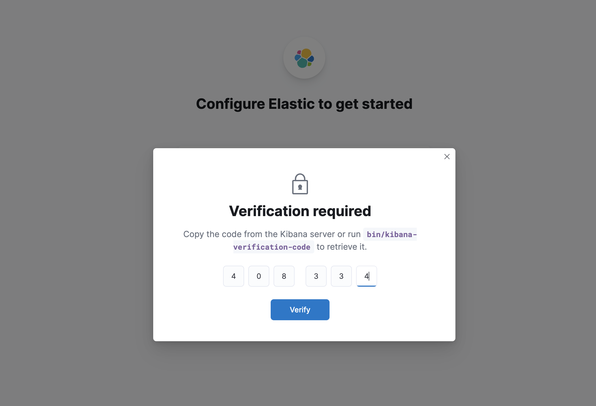

Задание:
1. Установить Elasticsearch
2. Установить Kibana

Для установки проделаем все инструкции из файла `elastic_kibana_install.sh`. При этом подключимся заранее прокинув порт 5601.
```bash
ssh -i private_key ubuntu@130.193.51.196 -L 5601:127.0.0.1:5601
```
При выполнении установки, во время рестарта сервиса: 
```bash
systemctl restart elasticsearch
```
возникает проблема 
Чтобы решить эту проблему, нужно запустить
```bash
sudo nano /etc/elasticsearch/jvm.options
```
и раскомментить строчки поменяв значения, тем самым ограничив heap memory для jvm до 1гб:
```bash 
# Xms represents the initial size of total heap space
# Xmx represents the maximum size of total heap space

-Xms256m
-Xmx256m
``` 

Далее, соответственно инструкции заходим по адресу http://localhost:5601/, вводим токен, верификационный код и авторизуемся.


