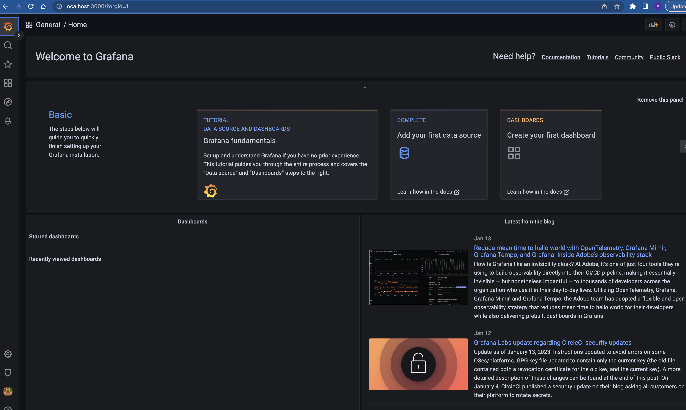
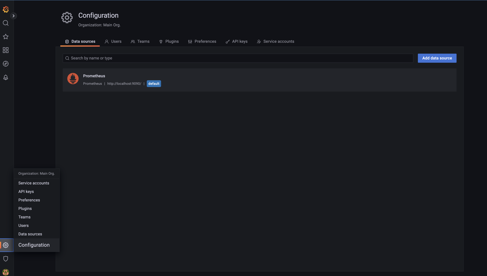
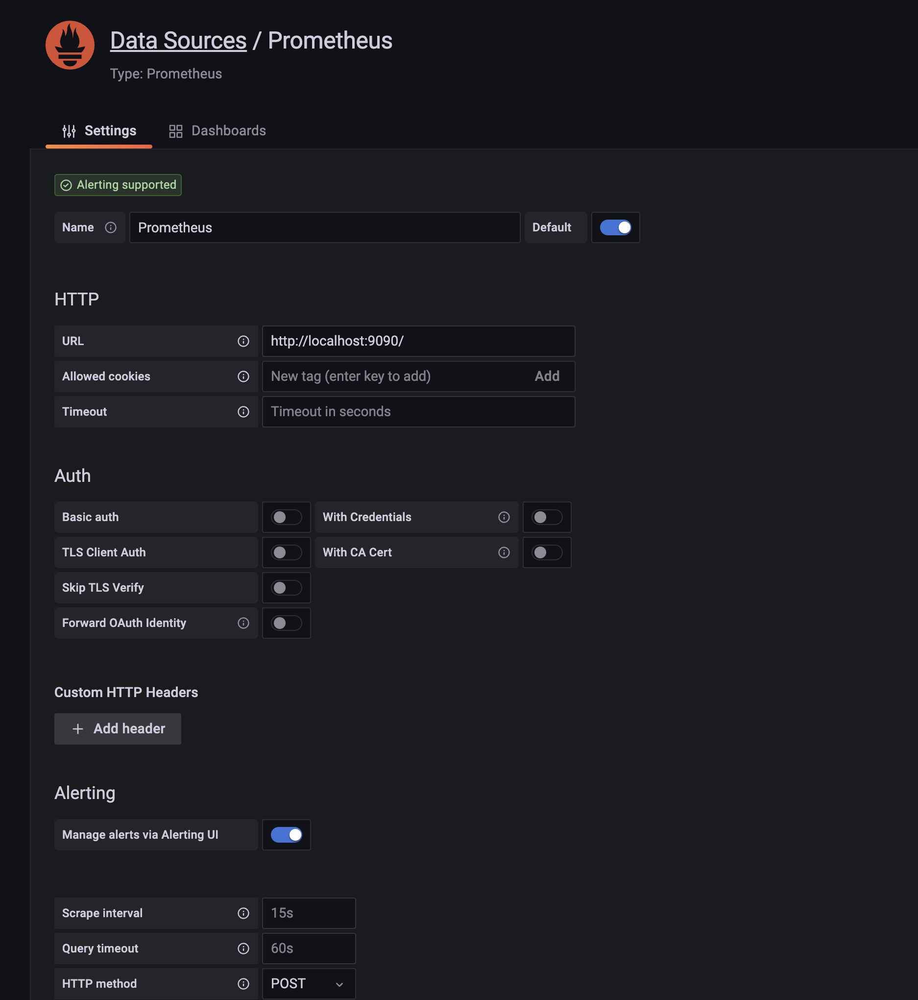
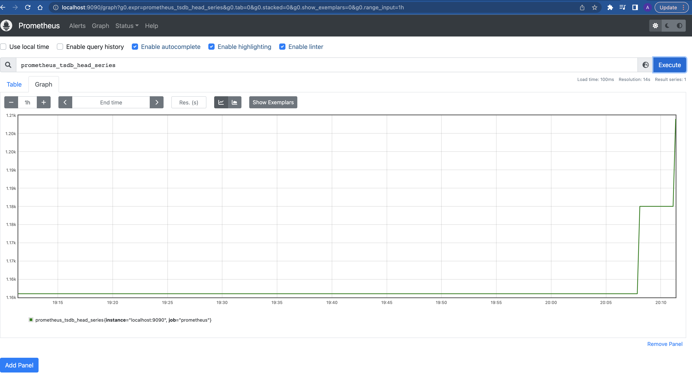

1. 
Установим графану через deb-пакет и далее запускаем как службы systemd

```bash
sudo apt-get install -y adduser libfontconfig1
wget https://dl.grafana.com/oss/release/grafana_9.3.1_amd64.deb
sudo dpkg -i grafana_9.3.1_amd64.deb

sudo systemctl daemon-reload 
sudo systemctl start grafana-server 
sudo systemctl status grafana-server 
sudo systemctl enable grafana-server.service 
```
Зайдем по адресу http://localhost:3000/ и увидим 


2. 
Далее для настройки параметров зайдем
```bash
sudo nano etc/grafana/grafana.ini
```
найдем и поменяем соответсвующие параметры и перезапустим сервис: 
```bash
[users]
default_theme = dark

[date_formats]
default_timezone = Europe/Moscow

[dashboards]
versions_to_keep = 30
```
3. 
Добавляем в конфигурации прометеус



Переходим в прометеус и смотрим: 