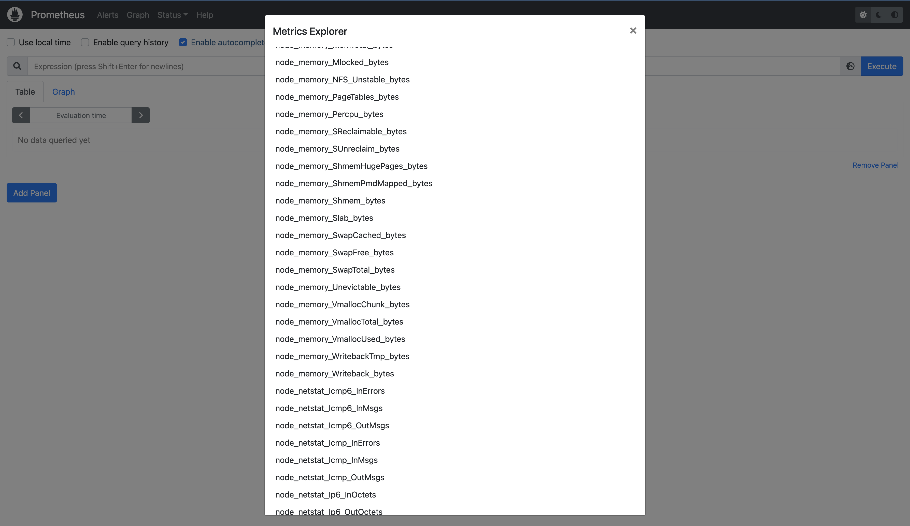

Задание
1. Установить Node Exporter и добавить его в Prometheus
Проведем установку Node Exporter используя `node_exp_install.sh`.

2. Поскольку не все коллекторы используются в вашей системе, необходимо отключить те, которые не используются.

Отключим неиспользуемые сервисы, добавив в `/lib/systemd/system/node_exporter.service` записи `--collector.disable-defaults --collector.<имя сервиса>`:
```
--collector.disable-defaults \
--collector.cpu \
--collector.diskstats \
--collector.filesystem \
--collector.loadavg \
--collector.meminfo \
--collector.netstat \
--collector.sockstat \
--collector.time \
--collector.textfile
```

Изменненный сервис можно посмотреть в `node_expoter.service`.