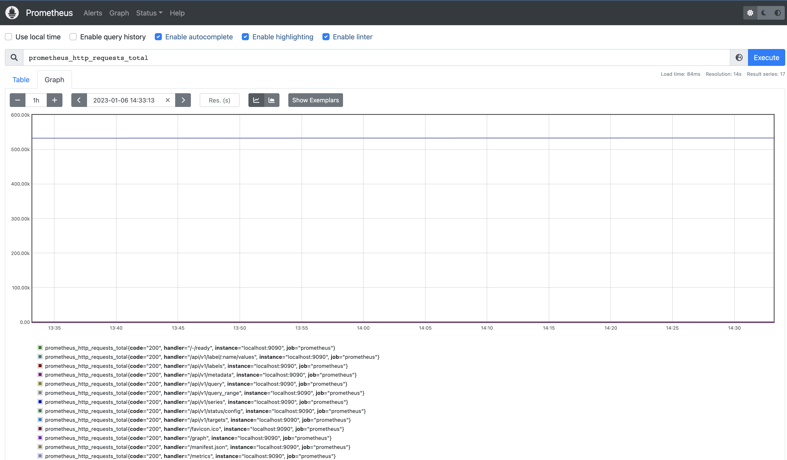
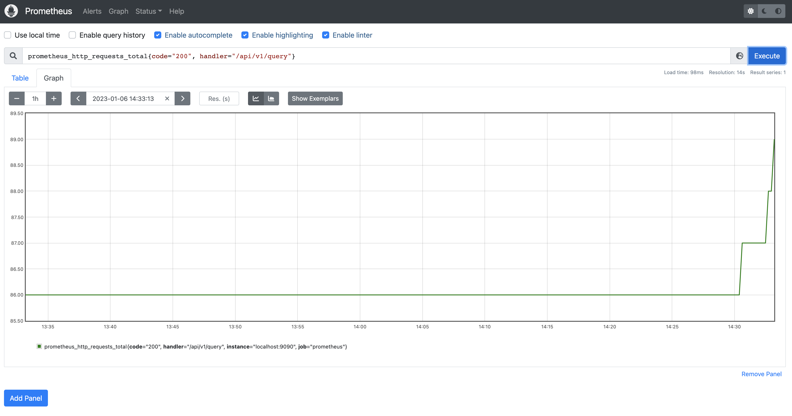
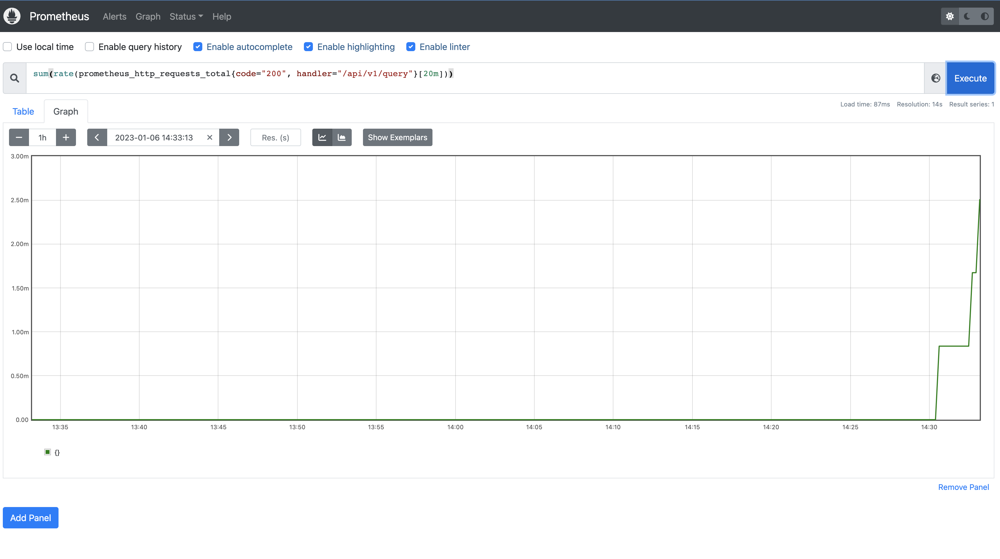
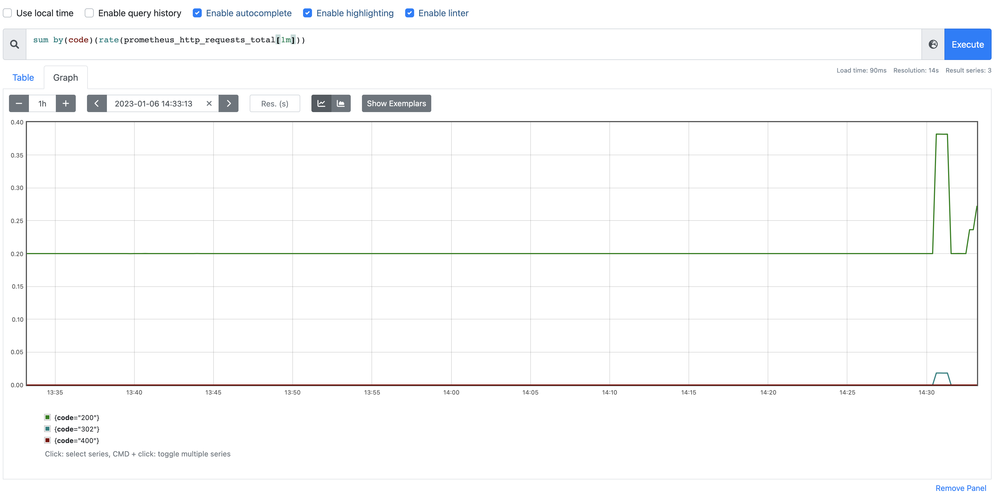
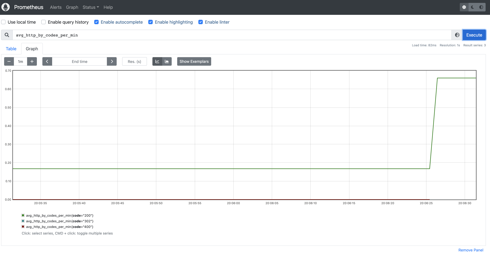
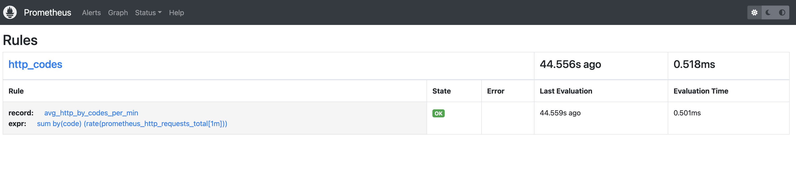

HW2

1. Установить и настроить Prometheus, замониторить пром.
Для установки и настрокйки Prometheus воспользоваться коммандами из скрипта `prometheus_istall.sh`
2. Показать использование PromQL.

    Количество http-запросов, получаемые Prometheus'ом:
    
    
    Количество http-запросов, получаемые Prometheus'ом, с кодом 200 по пути "/api/v1/query"
    
    
    Cреднее количество http-запросов, получаемые Prometheus'ом, с усреднением за 20 мин с кодом 200 по пути "/api/v1/query"
    

    Cреднее количество http-запросов сгруппированные по http-кодам, получаемые Prometheus'ом за 1 мин
    
3. Записать recording rule для какого-либо сложного вычисления.

    - Записываем recording rule для последнего запроса из пункта выше в файл first_rule.yml 
    - Переносим файл first_rule.yml в `etc/prometheus` 
    - Добавляем в конфиг Prometheus /etc/prometheus/prometheus.yml путь к файлу c recording rule
        ```bash
        rule_files:
            - "first_rule.yml"
        ```
    - Перезапустим сервис командой 
        ```bash
        service prometheus restart
        ```
    Проверяем, наличие команды поустановленному нами рекорду `avg_http_by_codes_per_min`.
    
    